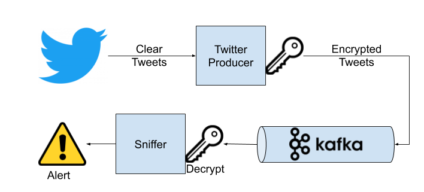
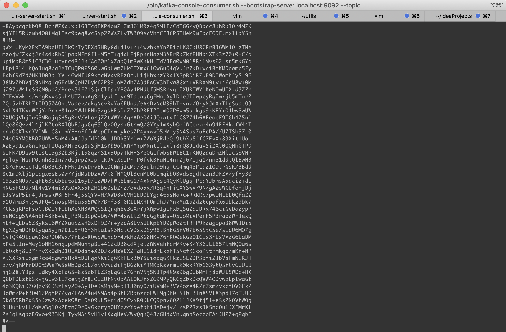

# Práctica BigData Processing
Ignacio Gallegos Sánchez

## Enunciado

El enunciado de la práctica puede descargarse de [aquí](./resources/EspiasBigData.pdf) en formato PDF.

## Spark Streaming (obligatoria)

El enunciado de la parte de streaming solicita obtener los datos de unos archivos CSV con los datos provenientes de los dispositivos IOT.

Para hacerlo más realista, me he tomado la libertad de **obtener, encriptar y encolar** los mensajes desde Twitter a Kafka directamente. De este modo tenemos un flujo continuo de mensajes totalmente aleatorio en tiempo real, viendo así una aplicación directa de Spark Streaming. Las demás partes del ejercicio son exactamente como se solicitaban en el enunciado (con las peculiaridades propias de la importación de mensajes de twitter, por ejemplo que en vez de disponer del ID de un dispositivo IOT, tendremos un nombre de usuario).

A grandes rasgos tendremos una arquitectura como la siguiente:

<center></center>


### Kafka

Lo primero que haremos será descargar kafka y escribir unos comandos básicos para ejecutarlo en nuestro ordenador.

Primero arrancaremos kafka con la configuración básica:

```bash
./bin/zookeeper-server-start.sh config/zookeeper.properties
./bin/kafka-server-start.sh config/server.properties
```

Una vez arrancado crearemos el **topic** usado en nuestra práctica, en mi caso "**keepcoding**":

```bash
./bin/kafka-topics.sh --create --bootstrap-server localhost:9092 --replication-factor 1 --partitions 1 --topic keepcoding
```

Por último arrancamos un consumer de consola y lo dejamos a la escucha:

```bash
./bin/kafka-console-consumer.sh --bootstrap-server localhost:9092 --topic keepcoding --from-beginning
```


### Twitter producer

El producer está en el proyecto paralelo de mi repositorio:

https://github.com/ignaciogallegossanchez/TwitterKafkaProducer

Como puede verse en la función principal del código:

```scala
package twitterproducer

object Main {
  def main(args: Array[String]): Unit = {
    println("Twitter Kafka Producer")

    val keepCodingReadWriter = new KeepCodingReadWriter(
      in = new TwitterReader(
        termsToTrack = List("#bigdata", "#keepcoding", "datos", "bigdata", "developer")
      ),
      out = new SparkProducer(
        servers = "localhost:9092",
        defaultTopic = "keepcoding"
      ).addEncryption(
        new AESEncryption(Array[Byte]('s','E','c','R','e','T','c','L','0','a','c','a','l','a','n','d')))
    )

    keepCodingReadWriter.start()
  }
}
```

Lo que hace es:
 * **Recibe los mensajes** de twitter (buscando los términos "#bigdata", "#keepcoding", "datos", "bigdata" y "developer")
 * Cada mensaje es **encriptado** con la clave "sEcReTcL0acaland" con algoritmo **AES-128**
 * Se **envían a Kafka** al topic "keepcoding"

Al ejecutarlo veremos en el consumer que dejamos ejecutando en el paso anterior ha empezado a mostrar mensajes encriptados como los siguientes:

<center></center>


_Nota_: Para que funcione correctamente debemos dar de alta nuestra cuenta de Twitter como desarrollador (en https://dev.twitter.com/apps/new), dar de alta una nueva aplicación, y rellenar los datos en el archivo "TwitterCredentials.scala":

```scala
package twitterproducer

// Twitter client App credentials
object TwitterCredentials {
  val CONSUMERKEY     = "cWJg5FzMPnrt5cokzlZsoyrGh"
  val CONSUMERSECRET  = "oVBG2zXk4Ief0i2KJCgxynV8irrGeGvCPcXwmKdKbb1Elvm6Mw"
  val APITOKEN        = "3405730379-OLIkayvQ5JupUoEaYP0UQgNsQNWUrj2cevH8oGp"
  val APITOKENSECRET  = "W8r9IeGMJiGtoFrXlNT798TwBou1NUhfCwzC5NUQX7VwO"
}
```


### Sniffer 

Para esta parte de la práctica, para facilitar la corrección y visualización del ejercicio, he dejado el grueso del código en la función "main" aunque en un entorno de producción no sería lo más recomendable.

El código en: AAAAAAAAQUUUUUUUUUUUIIIIIIIIIIIIII

El sniffer es el encargado de:
 * Desencriptar los mensajes
 * Formatear correctamente los datos recibidos
 * Tratarlos (dividir frases en palabras)
 * Filtrarlos (eliminar las que no tienen valor)
 * Hacer conteo de las más utilizadas en un rango temporal (1h)
 * Cruzar las 10 mas utilizadas con las que están en una lista negra
 * En caso de que el resultado contenga alguna palabra (es decir, de las 10 más utilizadas en la ventana temporal alguna estaba en la lista negra) enviar una notificación.
 
__¿Cómo abordar el ejercicio?__

Dado que en el enunciado se especifica que se debe procesar una ventana de una hora, **mi primera aproximación** fue la de utilizar el soporte de ventanas temporal que Spark nos brinda (usando "window" sobre un timestamp). Algo como lo siguiente:

```scala
.groupBy(window(col("timestamp"), "1 hour")).count()
```

Aunque es perfectamente usable, los **problemas** llegan al intentar quedarnos con los n-primeros elementos, probando con:
 * limit(10)
 * head(10)
 * Generando una columna indice y filtrando por ".where(col(index) < 10)"

En todos los casos obtengo un **error** del framework Spark indicando que no se soportan esas operaciones en modo streaming.

Tras varias horas de intentos, llego a la **segunda aproximación, y solución definitiva**: utilizar la propia ventana de validez dada por _Spark event-time streaming_.

A continuación procedo a comentar paso a paso las partes más importantes del código:

Primero, como es natural, creamos la sesión spark para conectarnos al cluster local:

```scala
    // Configure sparkSession. Will use al cores of local server ("local[*]")
    val spark = SparkSession
      .builder()
      .appName("Cloacalandia")
      .master("local[*]")
      .config("spark.io.compression.codec", "snappy") // Avoids LZ4BlockInputStream.init exception when grouping
      .getOrCreate()
```

Sólo destacar que se ha de establecer el protocolo de compresión "snappy" para evitar conflictos con el algoritmo de compresión de scala.

El siguiente paso importante es cómo leemos de kafka y dejamos preparado el dataframe:

```scala
    // Read from Kafka and prepare input
    val df1 = spark
      .readStream
      .format("kafka")
      .option("kafka.bootstrap.servers", "localhost:9092")
      .option("subscribe", "keepcoding") // Kafka topic
      .load()
      .select(decrypter(col("value")).as("decryptedValue"))
      .select(from_json(col("decryptedValue").cast("string"), Schemas.twitterPartialSchema).as("data"))
      .select(
          expr("cast(cast(data.timestamp_ms as double)/1000 as timestamp) as timestamp"),
          col("data.id").as("MsgID"),
          col("data.text").as("MsgText"),
          col("data.user.id").as("UserID"),
          col("data.user.name").as("UserName"),
          col("data.user.location").as("UserLocation")
        )
      .withWatermark("timestamp", "1 hour")
```

Aquí hay varios puntos intenresantes:
 1. Se lee en formato stream
 2. Se establece que se lee desde kafka, en localhost y del topic "keepcoding"
 3. Se **desencripta** la columna "value" de la entrada de kafka (el que contiene el mensaje directamente de twitter) utilizando la función (UDF) "decrypter", y deja el resultado en la columna "decryptedValue".
 4. El contenido de "data" es ahora el JSON que describe el mensaje del usuario, el cual contiene multitud de campos. En el siguiente paso **leemos la estructura del JSON** utilizando el UDF predefinido "from_json" y ponemos el resultado en "data".
 5. Nos quedamos con los datos que más nos interesan del mensaje de twitter, haciendo casting de la hora UNIX al tipo "timestamp"
 6. **Muy importante**, establecemos para el event-time streaming que la marca temporal está en la columna "timestamp", además establecemos que **debe desechar los datos de más de 1 hora**.
 
En este punto tendremos un DataFrame con los siguientes campos:
 * **timestamp (timestamp)**: contiene la marca temporal del mensaje (marcado en origen)
 * **MsgID (long)**: Contiene el ID único del mensaje
 * **MsgText (string)**: El texto introducido por el usuario en el mensaje
 * **UserID (long)**: El ID único del usuraio que envía el mensaje
 * **UserName (string)**: El nombre del usuario de twitter que envía el mensaje
 * **UserLocation (string)**: La ciudad desde la que se envía el tweet (el nombre)

A continuación nos acercamos al objetivo del ejercicio:

```scala
    // Convert to a list of words, filtered and clean, and without dupplicated messages, and sorted
    val dfWords = df1
      .dropDuplicates("MsgID")
      .select(
        explode(splitter(col("MsgText"))).as("Word")//,
      )
      .filter(row => {
        val word = row.getAs[String]("Word")
        word.size > 1 && !( articulos.contains(word) ||
          preposiciones.contains(word) ||
          conjuncionSubordinada.contains(word) ||
          conjuncionCoordinada.contains(word))
      })
      .groupBy($"Word").count( )
      .orderBy($"count".desc)
      .select($"Word")
 ```
 
 En donde:
  1. Eliminamos los duplicados, basándonos en el ID del mensaje original
  2. Utilizando el UDF "splitter" (que divide el mensaje en palabras), generamos un nuevo DF un una columna llamada "Word" que contiene todas las palabras del mensaje (y de todos los demás)
  3. Filtramos las palabras, quitando los articulos, preposiciones y conjunciones (quitando también las palabras de longitud menor que 2 caracteres)
  4. Agrupamos las palabras, generando una nueva columna "count" con el número de repeticiones
  5. Ordenamos por el número de ocurrencias en orden descendente
  6. Por último nos quedamos tan solo con la columna de palabras, ahora ordenada.
  
 En este momento el DataFrame tiene un schema como el siguiente:
  * **Word (string)**: Palabra
  
 Lo siguiente que haremos es ejecutar la salida **cada hora** en memoria:
 
 ```scala
    // Put table in memory ready for requests
    val query = dfWords.writeStream
      .trigger(Trigger.ProcessingTime("1 hour"))
      .format("memory")
      .outputMode("complete")
      .queryName("resultTable")
      .start()
 ```
 
En donde:
 1. Indicamos que se debe ejecutar cada hora
 2. Configuramos para dejarla en memoria
 3. El modo de salida lo indicamos como completo (cada hora veremos los datos de una hora)
 4. Dejamos el resultado listo para consultar como si de la tabla "resultTable" se tratara
 5. Indicamos .start() pero **NO** await termination, ya que queremos que siga la ejecución
 
**De este modo, gracias al watermark de 1 hora, solo tenemos datos de una hora hacia atrás, y esta tabla se generará cada hora, sobre los datos que tenemos, es decir, CADA HORA TRATAREMOS LOS DATOS DE UNA HORA ATRÁS**

Para quedarnos con los 10 primeros elementos y comprobar si están en la lista negra de palabras, haremos una consulta sobre esta tabla en memoria:

```scala
    // Check if top-10 words are blacklisted, and notify
    while(true){
      val topTen = spark.sql("SELECT * from resultTable LIMIT 10").as("result")
      val result = topTen.join(blacklist, $"result.Word"=== col("black.BlacklistWord"), "inner")
      if (result.count() > 0)
        notifier.notify("ALARMA AL GOBIERNO DE CLOACALANDIA")
      Thread.sleep(3600*1000)
    }
```
En donde:
 1. Hacemos una consulta quedándonos con los 10 primeras palabras (ya estaban ordenadas así que son las 10 que más se repiten)
 2. Hacemos un join con las palabras de la lista negra
 3. Si el resultado tiene algún elemento, entonces es que las 10 palabras más repetidas están en la lista negra, luego debemos notificar
 4. Dormimos hasta la siguiente hora (3600 segundos)


## GraphX (opcional)

No implementada
